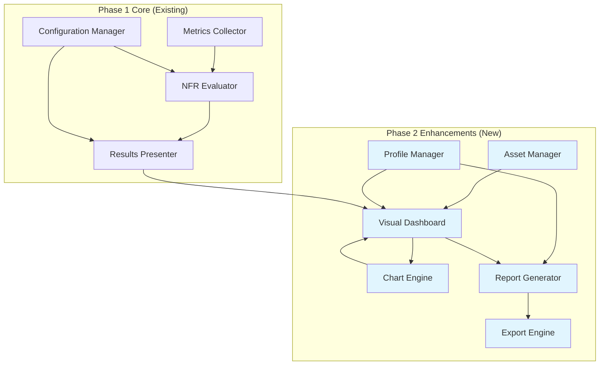

# Design Document: Blackbox Phase 2 Enhancement

## Overview

Blackbox Phase 2 transforms the existing Page Health Analyzer into a visually impactful, presentation-ready tool designed specifically for hackathon demonstration and professional showcasing. Building upon the solid Phase 1 foundation of performance metrics collection and NFR evaluation, Phase 2 adds comprehensive data visualization, professional reporting capabilities, expandable user interfaces, and historical profiling features.

The enhanced system maintains backward compatibility while introducing five major enhancement areas: visual branding and identity, expandable presentation interface, enhanced metrics display with color coding, interactive data visualization with charts, and comprehensive report generation with PDF export capabilities.

## Architecture

The Phase 2 architecture extends the existing modular pipeline with new presentation and export components:



### Component Integration Strategy

**Backward Compatibility**: All Phase 1 components (MetricsCollector, NFREvaluator, ResultsPresenter, ConfigurationManager) remain unchanged, ensuring existing functionality continues to work seamlessly.

**Enhancement Layer**: New Phase 2 components operate as an enhancement layer that consumes Phase 1 outputs and provides additional presentation and export capabilities.

## Components and Interfaces

### Asset Manager

**Purpose**: Manage branding assets and visual identity elements for professional presentation.

**Key Methods**:
```typescript
interface AssetManager {
  getLogoPath(): string
  getBrandingElements(): BrandingConfig
  applyBrandingToElement(element: HTMLElement): void
  generateBrandedHeader(): HTMLElement
}
```

**Responsibilities**:
- Organize logo.png and branding assets in `/src/assets/` folder
- Provide consistent branding across popup, reports, and exported documents
- Handle asset loading and fallback for missing resources
- Generate branded headers for reports and exports

### Visual Dashboard

**Purpose**: Enhanced popup interface with expandable capabilities and improved user experience.

**Key Methods**:
```typescript
interface VisualDashboard {
  renderExpandedView(): void
  renderNormalView(): void
  toggleExpansion(): void
  updateMetricsDisplay(metrics: AllMetrics, thresholds: Thresholds): void
  showLoadingIndicator(operation: string): void
  hideLoadingIndicator(): void
}
```

**Expansion Strategy**:
- **Normal Mode**: Standard popup (current size, ~400x600px max)
- **Expanded Mode**: Utilize Chrome extension popup maximum dimensions (800x600px) or create new tab for full-screen presentation
- **Transition**: Smooth CSS transitions with 300ms duration
- **State Management**: Preserve all data and functionality across view modes

**Enhanced Metrics Display**:
- **Threshold Column**: Show expected values alongside actual metrics
- **Color Coding**: Apply red/yellow/green colors to metric values based on threshold comparison
- **Visual Indicators**: Use icons and progress bars for immediate visual impact

### Chart Engine

**Purpose**: Generate professional data visualizations for performance metrics.

**Technology Selection**: **Chart.js** - Based on research findings, Chart.js is the optimal choice because:
- Lightweight (40KB minified/gzipped) - suitable for browser extension
- Simple integration with TypeScript
- 8 core chart types including bar, line, pie, and doughnut
- Excellent animation and interactivity support
- Highest developer satisfaction in State of JavaScript 2022
- No external dependencies

**Key Methods**:
```typescript
interface ChartEngine {
  generatePerformanceCharts(metrics: AllMetrics): ChartConfiguration[]
  renderChart(container: HTMLElement, config: ChartConfiguration): void
  selectOptimalChartType(metric: MetricType): ChartType
  createInteractiveChart(data: ChartData): Chart
}
```

**Chart Selection Logic**:
- **Load Time Metrics**: Horizontal bar chart showing actual vs threshold
- **Resource Size Distribution**: Pie chart showing breakdown by resource type
- **Performance Timeline**: Line chart showing navigation timing phases
- **Health Status Overview**: Doughnut chart showing PASS/WARN/FAIL distribution

**Implementation Strategy**:
```typescript
// Chart.js integration with TypeScript
import { Chart, ChartConfiguration, registerables } from 'chart.js';
Chart.register(...registerables);

const chartConfig: ChartConfiguration = {
  type: 'bar',
  data: {
    labels: ['Load Time', 'TTFB', 'Page Size'],
    datasets: [{
      label: 'Actual',
      data: [actualValues],
      backgroundColor: colorBasedOnThreshold
    }, {
      label: 'Threshold',
      data: [thresholdValues],
      backgroundColor: '#e0e0e0'
    }]
  },
  options: {
    responsive: true,
    plugins: {
      title: { display: true, text: 'Performance Metrics vs Thresholds' }
    }
  }
};
```

### Report Generator

**Purpose**: Create comprehensive text and structured reports for sharing and documentation.

**Key Methods**:
```typescript
interface ReportGenerator {
  generateTextReport(analysis: OverallHealth, metadata: ReportMetadata): string
  generateStructuredReport(analysis: OverallHealth, profile?: SavedProfile): ReportData
  formatMetricsSection(metrics: AllMetrics, thresholds: Thresholds): string
  createExecutiveSummary(health: OverallHealth): string
}
```

**Report Structure**:
```
BLACKBOX PERFORMANCE ANALYSIS REPORT
====================================

Generated: [Date/Time]
URL: [Target URL]
Browser: [Browser Name/Version]
OS: [Operating System]

EXECUTIVE SUMMARY
-----------------
Overall Health: [PASS/WARN/FAIL]
Performance Score: [0-100]
Key Issues: [Top 3 concerns]

DETAILED METRICS
----------------
[Formatted table with actual vs threshold values]

RECOMMENDATIONS
---------------
[Actionable improvement suggestions]

TECHNICAL DETAILS
-----------------
[Raw metrics and timing data]
```

### Export Engine

**Purpose**: Generate professional PDF reports with graphical content.

**Technology Selection**: **jsPDF + html2canvas** - Based on research findings:
- jsPDF: Mature, feature-rich PDF generation library
- html2canvas: Captures DOM elements as images for PDF inclusion
- Combined approach allows rich visual content in PDFs
- Automatic page splitting for long content
- No server-side dependencies (client-side only)

**Key Methods**:
```typescript
interface ExportEngine {
  generatePDF(reportData: ReportData, charts: HTMLElement[]): Promise<Blob>
  addBrandingToPDF(doc: jsPDF): void
  captureChartsAsImages(chartElements: HTMLElement[]): Promise<string[]>
  formatPDFLayout(content: ReportContent): PDFLayout
}
```

**PDF Generation Strategy**:
```typescript
import jsPDF from 'jspdf';
import html2canvas from 'html2canvas';

async generatePDF(reportData: ReportData): Promise<Blob> {
  const doc = new jsPDF();
  
  // Add branding header
  this.addBrandingToPDF(doc);
  
  // Capture charts as images
  const chartImages = await this.captureChartsAsImages(reportData.charts);
  
  // Add content with automatic page breaks
  doc.text(reportData.summary, 20, 40);
  
  // Add chart images
  chartImages.forEach((image, index) => {
    if (index > 0) doc.addPage();
    doc.addImage(image, 'PNG', 20, 60, 170, 100);
  });
  
  return doc.output('blob');
}
```

### Profile Manager

**Purpose**: Handle saving, retrieving, and managing historical page analysis profiles.

**Storage Strategy**: **Chrome Extension Storage API** - Based on research:
- `chrome.storage.local` provides 5MB storage limit
- Persists across browser sessions and cache clearing
- Accessible from all extension contexts
- Asynchronous API with bulk operations
- More reliable than localStorage for extensions

**Key Methods**:
```typescript
interface ProfileManager {
  saveProfile(analysis: OverallHealth, url: string): Promise<string>
  getProfiles(): Promise<SavedProfile[]>
  deleteProfile(profileId: string): Promise<void>
  exportProfile(profileId: string): Promise<ReportData>
}
```

**Data Model**:
```typescript
interface SavedProfile {
  id: string;                    // UUID for unique identification
  url: string;                   // Target webpage URL
  timestamp: number;             // Unix timestamp of analysis
  analysis: OverallHealth;       // Complete analysis results
  metrics: AllMetrics;           // Raw metrics data
  thresholds: Thresholds;        // Thresholds used for analysis
  browserInfo: BrowserInfo;      // Browser context information
}

interface BrowserInfo {
  name: string;                  // Browser name (Chrome, Firefox, etc.)
  version: string;               // Browser version
  userAgent: string;             // Full user agent string
  platform: string;             // Operating system
}
```

**Storage Implementation**:
```typescript
class ProfileManager {
  private readonly STORAGE_KEY = 'blackbox_profiles';
  private readonly MAX_PROFILES = 100; // Prevent storage overflow
  
  async saveProfile(analysis: OverallHealth, url: string): Promise<string> {
    const profile: SavedProfile = {
      id: this.generateUUID(),
      url,
      timestamp: Date.now(),
      analysis,
      metrics: analysis.metrics,
      thresholds: analysis.thresholds,
      browserInfo: this.getBrowserInfo()
    };
    
    const profiles = await this.getProfiles();
    profiles.unshift(profile); // Add to beginning (newest first)
    
    // Maintain storage limits
    if (profiles.length > this.MAX_PROFILES) {
      profiles.splice(this.MAX_PROFILES);
    }
    
    await chrome.storage.local.set({ [this.STORAGE_KEY]: profiles });
    return profile.id;
  }
}
```

## Data Models

### Enhanced UI Types

```typescript
interface BrandingConfig {
  logoPath: string;
  primaryColor: string;
  secondaryColor: string;
  fontFamily: string;
}

interface ViewMode {
  isExpanded: boolean;
  containerElement: HTMLElement;
  dimensions: { width: number; height: number };
}

interface ThresholdDisplay {
  metric: string;
  actualValue: number;
  thresholdValue: number;
  status: HealthStatus;
  colorCode: string;
  formattedActual: string;
  formattedThreshold: string;
}
```

### Chart Configuration Types

```typescript
interface ChartConfiguration {
  type: 'bar' | 'line' | 'pie' | 'doughnut';
  title: string;
  data: ChartData;
  options: ChartOptions;
}

interface ChartData {
  labels: string[];
  datasets: Dataset[];
}

interface Dataset {
  label: string;
  data: number[];
  backgroundColor: string | string[];
  borderColor?: string;
}
```

### Report and Export Types

```typescript
interface ReportMetadata {
  generatedAt: Date;
  url: string;
  browserInfo: BrowserInfo;
  reportType: 'text' | 'pdf';
}

interface ReportData {
  metadata: ReportMetadata;
  summary: string;
  metricsTable: string;
  recommendations: string[];
  charts: HTMLElement[];
  rawData: AllMetrics;
}

interface PDFLayout {
  pageSize: 'a4' | 'letter';
  margins: { top: number; right: number; bottom: number; left: number };
  headerHeight: number;
  footerHeight: number;
}
```

## Correctness Properties

*A property is a characteristic or behavior that should hold true across all valid executions of a system-essentially, a formal statement about what the system should do. Properties serve as the bridge between human-readable specifications and machine-verifiable correctness guarantees.*

Now I'll analyze the acceptance criteria to determine which can be tested as properties:

### Property 1: Consistent Branding Application
*For any* interface element, report, or documentation generated by Blackbox, the system should consistently use "Blackbox" branding, logo, and visual identity elements without referencing the old "Page Health Analyzer" name.
**Validates: Requirements 1.1, 1.3, 1.4**

### Property 2: View Mode State Preservation
*For any* data or functionality available in normal popup mode, switching to expanded mode and back should preserve all information and capabilities without loss or corruption.
**Validates: Requirements 2.5**

### Property 3: Expandable Interface Behavior
*For any* popup expansion or collapse operation, the Visual Dashboard should transition smoothly within performance bounds and display all content without scrolling in expanded mode.
**Validates: Requirements 2.2, 2.3**

### Property 4: Threshold-Based Color Coding
*For any* performance metric and threshold comparison, the Threshold Display should apply consistent color coding where values within threshold are green, 10-50% over threshold are yellow, and >50% over threshold are red.
**Validates: Requirements 3.2, 3.3, 3.4, 3.5**

### Property 5: Metrics Display Completeness
*For any* performance analysis, the enhanced metrics display should show both actual values and threshold values in a structured format with appropriate color coding applied to values.
**Validates: Requirements 3.1**

### Property 6: Chart Generation and Display
*For any* metrics data, the Chart Engine should generate appropriate visualizations when requested and provide interactive controls for showing and hiding chart sections.
**Validates: Requirements 4.2, 4.3**

### Property 7: Report Generation Functionality
*For any* completed analysis, the system should provide both text and PDF report generation capabilities that produce comprehensive, formatted output suitable for sharing.
**Validates: Requirements 5.2, 5.4**

### Property 8: PDF Content Completeness
*For any* PDF report generated, the Export Engine should include all required metadata (plugin name, logo, date/time, browser info, OS info) and maintain professional formatting.
**Validates: Requirements 5.5, 8.1, 8.2, 8.3, 8.5**

### Property 9: Profile Storage and Retrieval
*For any* page analysis, the Profile Manager should be able to save complete analysis data with metadata and retrieve it in chronological order with all necessary information for report generation.
**Validates: Requirements 6.2, 6.3, 6.4, 7.4**

### Property 10: Profile List Display Format
*For any* saved profile, the profile list should display URL, date/time, and action buttons in a consistent format with appropriate icons and functionality.
**Validates: Requirements 6.4**

### Property 11: Historical Report Generation Consistency
*For any* saved profile, generating reports from historical data should produce the same format and quality as reports generated from current analysis, using the historical data and timestamps.
**Validates: Requirements 7.1, 7.2, 7.3**

### Property 12: Phase 1 Backward Compatibility
*For any* Phase 1 functionality (metrics collection, NFR evaluation, threshold configuration, deployment methods, API interfaces), Phase 2 enhancements should not modify or break existing capabilities.
**Validates: Requirements 9.1, 9.2, 9.4, 9.5**

### Property 13: Loading Indicator Responsiveness
*For any* operation taking longer than 500 milliseconds, the system should display appropriate loading indicators to maintain user awareness of system activity.
**Validates: Requirements 10.5**

## Error Handling

Phase 2 extends the existing error handling strategy with additional considerations for new components:

### Asset Management Errors
- **Missing Assets**: Graceful fallback when logo.png or branding assets are unavailable
- **Asset Loading Failures**: Continue operation with default styling if custom assets fail to load
- **File Path Resolution**: Handle different deployment contexts (extension vs standalone)

### Chart Generation Errors
- **Chart.js Library Failures**: Provide fallback text-based visualization if Chart.js fails to load
- **Data Format Issues**: Validate metrics data before chart generation
- **Rendering Failures**: Display error message in chart container if rendering fails
- **Memory Constraints**: Handle large datasets gracefully with data sampling if needed

### PDF Generation Errors
- **jsPDF/html2canvas Failures**: Provide fallback text report if PDF generation fails
- **Canvas Rendering Issues**: Handle cases where DOM elements cannot be captured
- **Memory Limitations**: Implement progressive rendering for large reports
- **Browser Compatibility**: Detect and handle browsers with limited PDF support

### Storage and Profile Errors
- **Storage Quota Exceeded**: Implement profile cleanup when approaching storage limits
- **Data Corruption**: Validate profile data integrity on retrieval
- **Concurrent Access**: Handle multiple tabs attempting to save profiles simultaneously
- **Migration Issues**: Handle data format changes between versions

### UI Expansion Errors
- **Popup Size Limitations**: Handle browser-imposed popup size restrictions gracefully
- **Content Overflow**: Implement scrolling fallback if content exceeds expanded dimensions
- **State Synchronization**: Ensure UI state remains consistent across view mode changes
- **Animation Failures**: Provide instant fallback if CSS transitions fail

## Testing Strategy

The testing approach for Phase 2 maintains the existing unit and property-based testing framework while adding specific test categories for new functionality.

### Unit Testing Focus
- **Component Integration**: Test new Phase 2 components with existing Phase 1 components
- **UI Interactions**: Test button clicks, view mode transitions, and user interface behaviors
- **Asset Loading**: Test branding asset management and fallback scenarios
- **Storage Operations**: Test profile saving, loading, and data integrity
- **Report Generation**: Test text and PDF report creation with various data inputs

### Property-Based Testing Focus
- **Universal Properties**: Test behaviors that must hold across all inputs and configurations
- **Data Consistency**: Verify report generation produces consistent results across different invocation methods
- **State Preservation**: Ensure UI state and data integrity across view mode changes
- **Backward Compatibility**: Verify Phase 1 functionality remains unchanged
- **Cross-Browser Compatibility**: Test functionality across different browser environments

### Visual and Integration Testing
- **Chart Rendering**: Verify Chart.js integration produces expected visualizations
- **PDF Output**: Validate PDF generation includes all required content and formatting
- **UI Responsiveness**: Test interface expansion and animation performance
- **Brand Consistency**: Verify consistent application of Blackbox branding across all touchpoints

### Testing Configuration
- **Minimum 100 iterations** per property test for comprehensive coverage
- **Property test tags**: Each test references its design document property
- **Tag format**: `Feature: blackbox-phase2, Property {number}: {property_text}`
- **Framework**: Continue using Jest + fast-check for TypeScript property-based testing
- **New Dependencies**: Add Chart.js, jsPDF, and html2canvas to test environment

### Performance Testing Considerations
- **Animation Timing**: Test UI transitions complete within specified timeframes
- **Report Generation Speed**: Verify PDF and chart generation meet performance requirements
- **Storage Efficiency**: Test profile storage doesn't impact browser performance
- **Memory Usage**: Monitor memory consumption during chart and PDF generation

## Implementation Recommendations

### Technology Integration Strategy

**Chart.js Integration**:
```typescript
// Webpack configuration addition
module.exports = {
  // ... existing config
  externals: {
    'chart.js': 'Chart' // Use CDN version to reduce bundle size
  }
};

// TypeScript integration
import { Chart, ChartConfiguration } from 'chart.js/auto';
```

**PDF Generation Setup**:
```typescript
// Dynamic imports to reduce initial bundle size
const generatePDF = async () => {
  const [jsPDF, html2canvas] = await Promise.all([
    import('jspdf'),
    import('html2canvas')
  ]);
  // PDF generation logic
};
```

**Chrome Extension Storage**:
```typescript
// Manifest V3 permissions
{
  "permissions": ["storage"],
  "host_permissions": ["<all_urls>"] // For content script injection
}

// Storage implementation with error handling
class ProfileManager {
  async saveProfile(profile: SavedProfile): Promise<void> {
    try {
      await chrome.storage.local.set({ [`profile_${profile.id}`]: profile });
    } catch (error) {
      if (error.message.includes('QUOTA_EXCEEDED')) {
        await this.cleanupOldProfiles();
        await chrome.storage.local.set({ [`profile_${profile.id}`]: profile });
      } else {
        throw error;
      }
    }
  }
}
```

### File Structure Additions

```
src/
├── assets/                    # New: Branding assets
│   ├── logo.png              # Blackbox logo
│   └── branding.json         # Brand configuration
├── components/               # New: UI components
│   ├── VisualDashboard.ts    # Enhanced popup interface
│   ├── ChartEngine.ts        # Chart.js integration
│   ├── ThresholdDisplay.ts   # Enhanced metrics display
│   └── ProfileList.ts        # Profile management UI
├── services/                 # New: Business logic services
│   ├── AssetManager.ts       # Branding and asset management
│   ├── ReportGenerator.ts    # Text report generation
│   ├── ExportEngine.ts       # PDF export functionality
│   └── ProfileManager.ts     # Profile storage and retrieval
├── types/                    # Extended type definitions
│   ├── phase2.ts            # New Phase 2 specific types
│   └── index.ts             # Updated with Phase 2 types
└── core/                     # Existing Phase 1 components (unchanged)
    ├── PageHealthAnalyzer.ts
    ├── MetricsCollector.ts
    ├── NFREvaluator.ts
    ├── ResultsPresenter.ts
    └── ConfigurationManager.ts
```

### Deployment Strategy

**Development Approach**:
1. **Incremental Enhancement**: Build Phase 2 features as additive layers
2. **Feature Flags**: Use configuration to enable/disable Phase 2 features during development
3. **Backward Compatibility Testing**: Ensure Phase 1 functionality remains intact
4. **Progressive Enhancement**: Graceful degradation if Phase 2 features fail

**Build Configuration Updates**:
```javascript
// webpack.extension.config.js additions
module.exports = {
  // ... existing config
  entry: {
    popup: './src/popup.ts',
    background: './src/background.ts',
    content: './src/content.ts',
    // New Phase 2 entries
    dashboard: './src/components/VisualDashboard.ts'
  },
  plugins: [
    new CopyWebpackPlugin({
      patterns: [
        { from: 'src/assets', to: 'assets' }, // Copy branding assets
        // ... existing patterns
      ]
    })
  ]
};
```

**Extension Manifest Updates**:
```json
{
  "manifest_version": 3,
  "name": "Blackbox",
  "description": "Professional webpage performance analysis tool",
  "version": "2.0.0",
  "icons": {
    "16": "assets/logo.png",
    "48": "assets/logo.png",
    "128": "assets/logo.png"
  },
  "permissions": [
    "storage",
    "activeTab"
  ],
  "action": {
    "default_popup": "popup.html",
    "default_icon": "assets/logo.png"
  }
}
```

This design provides a comprehensive foundation for implementing Blackbox Phase 2 enhancements while maintaining the reliability and simplicity of the existing Phase 1 system. The modular architecture ensures that new features can be developed and tested independently while preserving backward compatibility and system integrity.