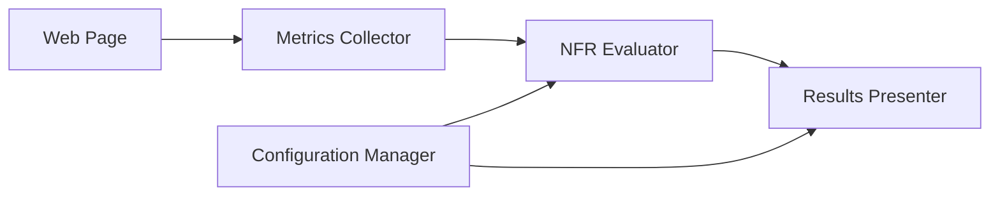

# Design Document: Page Health & NFR Analysis Tool

## Overview

The Page Health & NFR Analysis Tool is a lightweight browser-based system that analyzes webpage performance using standard Web APIs. The tool operates as either a browser extension or injectable script, collecting performance metrics and evaluating them against configurable Non-Functional Requirements (NFRs) to provide clear health assessments.

The system prioritizes simplicity, safety, and broad compatibility while delivering actionable insights to non-technical users. It operates entirely client-side using read-only browser APIs, ensuring it can safely analyze any webpage without modification.

## Architecture

The system follows a modular pipeline architecture with three core components:



### Component Responsibilities

- **Metrics Collector**: Gathers performance data using Web Performance APIs
- **NFR Evaluator**: Compares metrics against configurable thresholds
- **Results Presenter**: Formats and displays analysis results
- **Configuration Manager**: Handles threshold settings and persistence

## Components and Interfaces

### Metrics Collector

**Purpose**: Safely extract performance data from any webpage using standard browser APIs.

**Key Methods**:
```typescript
interface MetricsCollector {
  collectNavigationMetrics(): NavigationMetrics
  collectResourceMetrics(): ResourceMetrics  
  collectRenderingMetrics(): RenderingMetrics
  monitorNetworkActivity(): NetworkMetrics
}
```

**Data Sources**:
- `performance.getEntriesByType('navigation')` - Page load timing
- `performance.getEntriesByType('resource')` - Individual resource timing
- `performance.getEntriesByType('paint')` - Rendering milestones
- `PerformanceObserver` - Real-time network request monitoring

**Error Handling**: Gracefully handles missing APIs by returning partial data with clear indicators of what could not be measured.

### NFR Evaluator

**Purpose**: Compare collected metrics against configurable thresholds to determine health status.

**Key Methods**:
```typescript
interface NFREvaluator {
  evaluatePageSize(metrics: ResourceMetrics, threshold: number): HealthResult
  evaluateLoadTime(metrics: NavigationMetrics, threshold: number): HealthResult
  evaluateTTFB(metrics: NavigationMetrics, threshold: number): HealthResult
  generateOverallHealth(results: HealthResult[]): OverallHealth
}
```

**Health Status Logic**:
- **PASS**: Metric is within acceptable threshold
- **WARN**: Metric exceeds threshold by 10-50%
- **FAIL**: Metric exceeds threshold by more than 50%

### Results Presenter

**Purpose**: Display analysis results in a clear, non-technical format.

**Key Methods**:
```typescript
interface ResultsPresenter {
  formatHealthSummary(health: OverallHealth): string
  formatMetricDetails(metrics: AllMetrics, thresholds: Thresholds): string
  highlightWorstOffenders(metrics: AllMetrics): string[]
  renderResults(container: HTMLElement): void
}
```

**Output Format**:
- Overall health badge (PASS/WARN/FAIL with color coding)
- Key metrics with actual vs. threshold values
- Worst offenders section highlighting largest/slowest resources
- Human-readable units (seconds, MB, etc.)

### Configuration Manager

**Purpose**: Handle threshold configuration and persistence.

**Key Methods**:
```typescript
interface ConfigurationManager {
  getThresholds(): Thresholds
  setThreshold(metric: string, value: number): void
  resetToDefaults(): void
  validateThreshold(value: number): boolean
}
```

**Default Thresholds**:
- Page Size: 2MB
- Load Time: 5 seconds  
- TTFB: 3 seconds

## Data Models

### Core Metrics Types

```typescript
interface NavigationMetrics {
  loadTime: number        // Total page load time in ms
  ttfb: number           // Time to First Byte in ms
  domContentLoaded: number // DOM ready time in ms
  available: boolean     // Whether data was successfully collected
}

interface ResourceMetrics {
  totalSize: number      // Total page size in bytes
  resourceCount: number  // Number of resources loaded
  largestResource: {     // Details of largest resource
    name: string
    size: number
    type: string
  }
  available: boolean
}

interface RenderingMetrics {
  firstPaint: number     // First Paint time in ms
  largestContentfulPaint: number // LCP time in ms
  available: boolean
}

interface NetworkMetrics {
  ajaxCount: number      // Number of AJAX/fetch requests
  slowestRequest: {      // Details of slowest request
    url: string
    duration: number
  }
  available: boolean
}
```

### Health Assessment Types

```typescript
interface HealthResult {
  metric: string
  value: number
  threshold: number
  status: 'PASS' | 'WARN' | 'FAIL'
  message: string
}

interface OverallHealth {
  status: 'PASS' | 'WARN' | 'FAIL'
  score: number          // 0-100 composite score
  results: HealthResult[]
  worstOffenders: string[]
}
```

### Configuration Types

```typescript
interface Thresholds {
  pageSize: number       // In bytes
  loadTime: number       // In milliseconds
  ttfb: number          // In milliseconds
}
```

## Correctness Properties

*A property is a characteristic or behavior that should hold true across all valid executions of a system-essentially, a formal statement about what the system should do. Properties serve as the bridge between human-readable specifications and machine-verifiable correctness guarantees.*

Now I'll analyze the acceptance criteria to determine which can be tested as properties:

### Property 1: Metrics Collection Completeness
*For any* webpage with available Performance APIs, the Metrics Collector should always attempt to gather all supported timing data (navigation, resource, rendering, network) and return structured results indicating what data was successfully collected.
**Validates: Requirements 1.1, 1.2, 1.3, 1.4**

### Property 2: Safe Read-Only Operation
*For any* webpage, the Page Health Analyzer should never modify page state, global variables, or DOM elements, operating exclusively through read-only browser APIs.
**Validates: Requirements 1.5, 4.1, 4.4**

### Property 3: NFR Evaluation Consistency
*For any* collected metrics and threshold configuration, the NFR Evaluator should always produce a valid Health Status (PASS, WARN, or FAIL) based on consistent comparison logic where values within threshold are PASS, 10-50% over are WARN, and >50% over are FAIL.
**Validates: Requirements 2.1, 2.2, 2.3, 2.4**

### Property 4: Configuration Responsiveness
*For any* threshold modification, subsequent analyses should immediately use the new threshold values, and all metrics should have configurable thresholds with positive number validation.
**Validates: Requirements 2.5, 5.1, 5.3, 5.4**

### Property 5: Results Completeness
*For any* analysis result, the Results Presenter should always display an overall health status, include all available metrics with their values and thresholds, and highlight worst offenders when performance issues exist.
**Validates: Requirements 3.1, 3.2, 3.3**

### Property 6: Human-Readable Formatting
*For any* timing or size values, the Results Presenter should format them in appropriate human-readable units (ms/s for timing, KB/MB for sizes) with consistent precision.
**Validates: Requirements 3.4, 3.5**

### Property 7: Graceful Degradation
*For any* browser API errors or missing data, the Page Health Analyzer should catch exceptions, continue with available data, and clearly report what metrics could not be collected.
**Validates: Requirements 4.2, 7.1, 7.3**

### Property 8: Performance Bounds
*For any* webpage analysis, the Page Health Analyzer should complete within 10 seconds and never cause the target page to become unresponsive.
**Validates: Requirements 4.5, 7.4**

### Property 9: Default Configuration
*For any* fresh installation or reset, the Page Health Analyzer should use the specified default thresholds (2MB page size, 5s load time, 3s TTFB) and persist configuration changes between browser sessions.
**Validates: Requirements 5.2, 5.5**

### Property 10: Deployment Independence
*For any* deployment method (extension or injectable script), the Page Health Analyzer should maintain identical core functionality and complete analysis without external dependencies when deployed as a script.
**Validates: Requirements 6.4, 6.5**

### Property 11: Comprehensive Error Handling
*For any* analysis failure or network monitoring error, the Page Health Analyzer should record the failure, include it in results where appropriate, and display clear error messages when analysis fails completely.
**Validates: Requirements 7.2, 7.5**

## Error Handling

The system implements comprehensive error handling at multiple levels:

### API Availability Checks
- Gracefully detect missing Performance APIs
- Provide fallback behavior when specific timing data is unavailable
- Report capability limitations clearly to users

### Exception Management
- Wrap all API calls in try-catch blocks
- Continue analysis with partial data when individual metrics fail
- Log errors for debugging while maintaining user-friendly messages

### Data Validation
- Validate threshold configurations before applying
- Sanitize collected metrics to handle edge cases
- Ensure numeric values are within reasonable bounds

### Timeout Protection
- Implement analysis timeout to prevent hanging
- Abort long-running operations gracefully
- Provide feedback when analysis cannot complete

## Testing Strategy

The testing approach combines unit tests for specific functionality with property-based tests for universal correctness guarantees.

### Unit Testing Focus
- **API Integration**: Test specific Web Performance API interactions
- **Edge Cases**: Handle missing APIs, malformed data, extreme values
- **Error Conditions**: Verify proper error handling and user feedback
- **Configuration**: Test threshold validation and persistence

### Property-Based Testing Focus
- **Universal Properties**: Test behaviors that must hold across all inputs
- **Randomized Testing**: Generate diverse webpage scenarios and configurations
- **Correctness Guarantees**: Verify mathematical properties of evaluation logic
- **Safety Properties**: Ensure read-only operation and non-interference

### Testing Configuration
- **Minimum 100 iterations** per property test to ensure comprehensive coverage
- **Property test tags**: Each test references its design document property
- **Tag format**: `Feature: page-health-analyzer, Property {number}: {property_text}`
- **Framework**: Use fast-check for TypeScript property-based testing

### Deployment Testing
- **Browser Extension**: Test popup interface and content script injection
- **Injectable Script**: Verify standalone operation and console integration
- **Cross-Browser**: Validate functionality across Chrome, Firefox, Safari
- **Real-World Sites**: Test against diverse production websites

## Implementation Recommendations

### Technical Architecture Decision: Browser Extension vs Injectable Script

**Recommendation**: Implement as a **browser extension** with injectable script capability.

**Rationale**:
1. **User Experience**: Extension popup provides better UX than console output
2. **Persistence**: Extension can maintain configuration across sessions
3. **Accessibility**: Non-technical users prefer GUI over console commands
4. **Flexibility**: Extension can also inject scripts for programmatic use

### Technology Stack
- **Language**: TypeScript for type safety and better tooling
- **Build Tool**: Webpack for bundling and optimization
- **Testing**: Jest + fast-check for unit and property-based testing
- **Extension Framework**: Manifest V3 for future compatibility

### Deployment Strategy
1. **Primary**: Chrome extension with popup interface
2. **Secondary**: Standalone script bundle for console injection
3. **Distribution**: Chrome Web Store + GitHub releases

### Performance Considerations
- **Lazy Loading**: Load analysis components only when needed
- **Debouncing**: Prevent multiple simultaneous analyses
- **Memory Management**: Clean up observers and event listeners
- **Minimal Footprint**: Keep extension size under 1MB

This design provides a solid foundation for building a reliable, user-friendly page health analysis tool that meets all specified requirements while maintaining simplicity and broad compatibility.